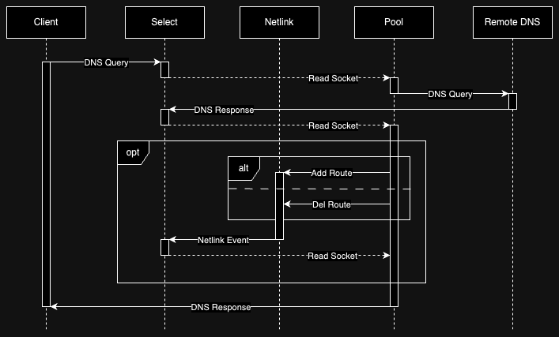

# gwhosts-proxy
DNS proxy/router for a specified list of hostnames

## How does this app work
1. The service proxies all DNS queries
2. Adds static routes combining similar addresses into subnets
3. Traffic for the list of hostnames goes through the specified gateway (e.g. VPN)



## Installation
  ```bash
  git clone https://github.com/sharupoff/gwhosts-proxy.git
  cd gwhosts-proxy

  # Prepare a gzipped list of hostnames (edit it before)
  gzip --keep gwhosts.example
  
  # Install dependencies
  python -m venv env
  ./env/bin/pip install .
  ```

## Usage
  ```bash
  ./env/bin/python -m gwhosts.main ./gwhosts.example.gz --ipv4-gateway=192.168.2.1 --ipv4-ifname=tun0 
  ```

## Supported Environments

### Operating Systems
- [x] GNU/Linux

### Python Interpreters
- [x] [CPython](https://github.com/python/cpython)
  - [x] [3.9](https://github.com/python/cpython/tree/3.9)
  - [x] [3.10](https://github.com/python/cpython/tree/3.10)
  - [x] [3.11](https://github.com/python/cpython/tree/3.11)
  - [x] [3.12](https://github.com/python/cpython/tree/3.12)
  - [x] [3.13](https://github.com/python/cpython/tree/3.13)
  - [x] [3.14](https://github.com/python/cpython/tree/v3.14.0a5)
- [x] [PyPy](https://github.com/pypy/pypy)
  - [x] [3.9](https://github.com/pypy/pypy/tree/py3.9)
  - [x] [3.10](https://github.com/pypy/pypy/tree/py3.10)

## Used resources
- [Introduction to Netlink](https://docs.kernel.org/next/userspace-api/netlink/intro.html)
- [Kernel routing policy](https://www.kernel.org/doc/Documentation/networking/policy-routing.txt)
- [IPRoute module](https://docs.pyroute2.org/iproute.html)
- [Domain Name System (DNS) Parameters](https://www.iana.org/assignments/dns-parameters/dns-parameters.xhtml)
- [DNS message format](https://en.wikipedia.org/wiki/Domain_Name_System#DNS_message_format)
- [Implement DNS in a weekend](https://implement-dns.wizardzines.com)